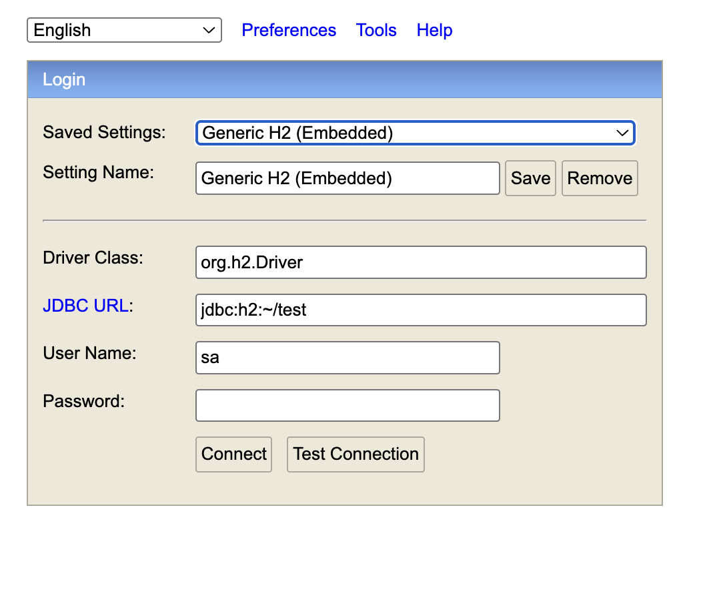
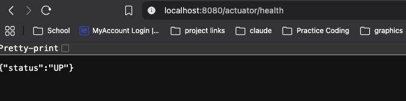
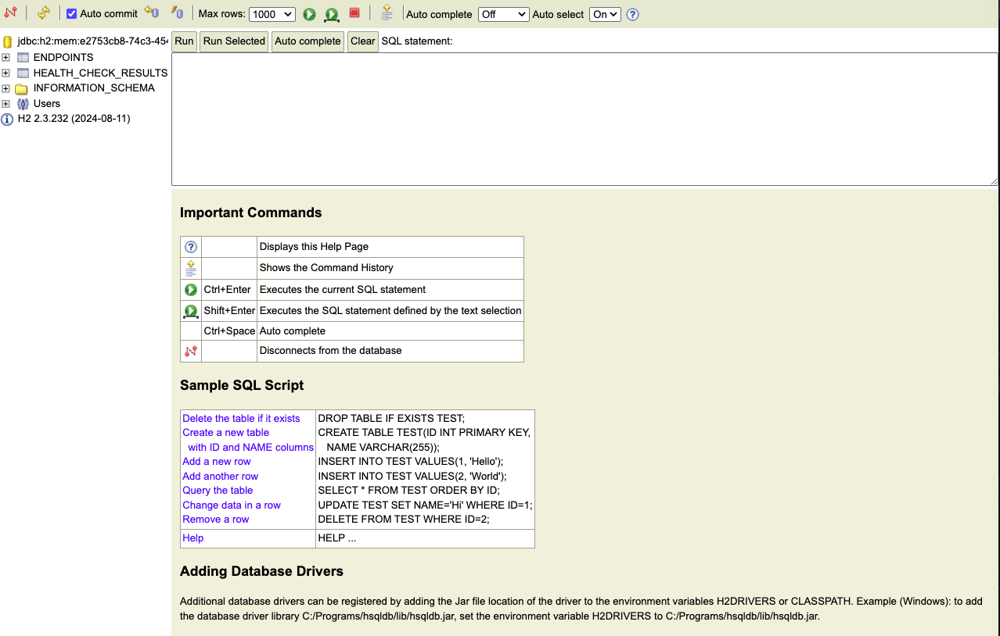
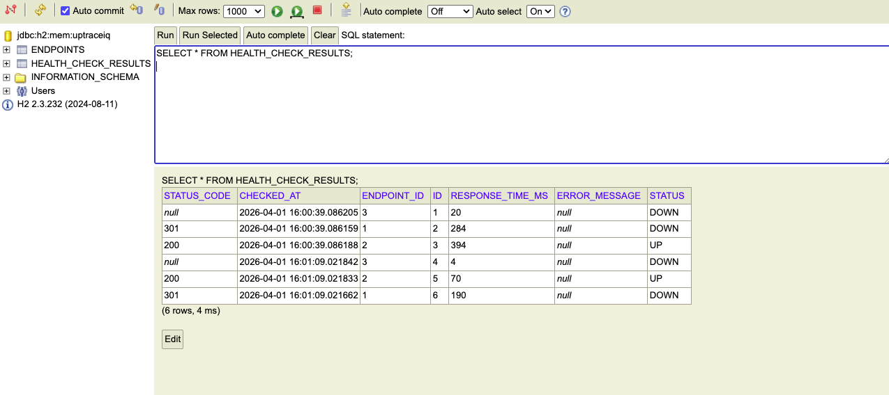
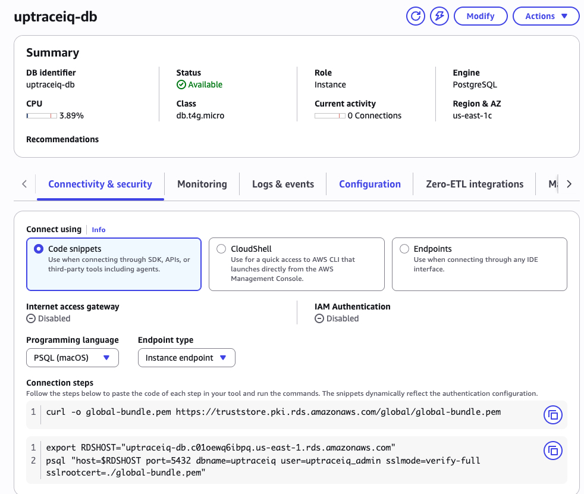
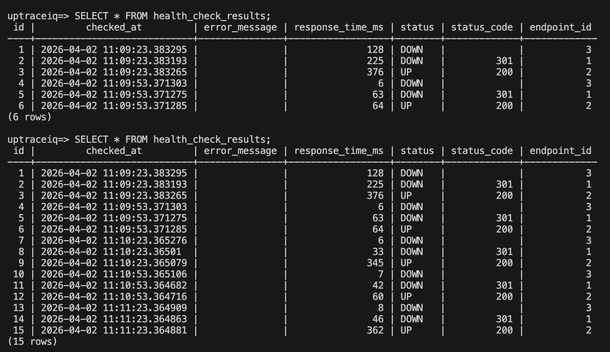
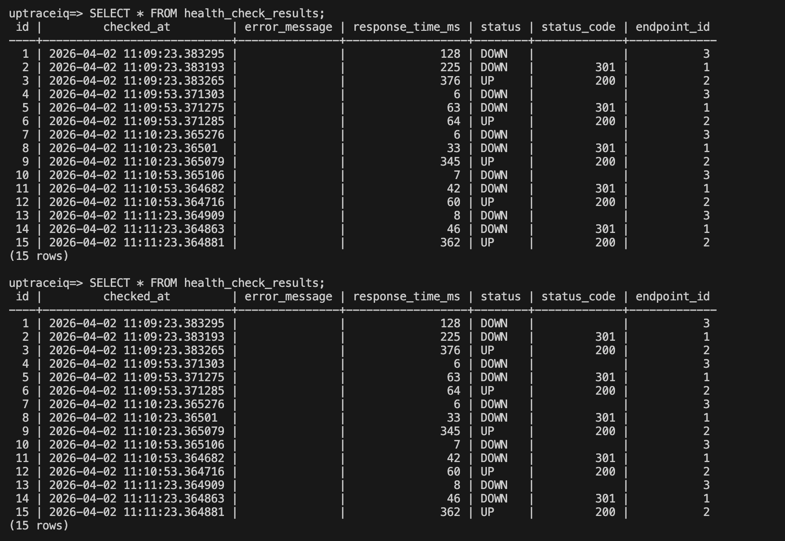
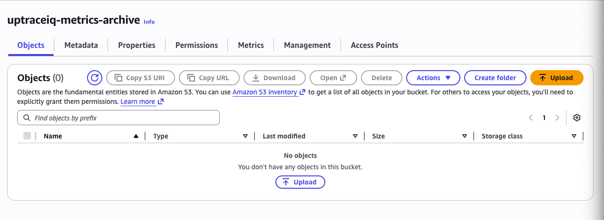
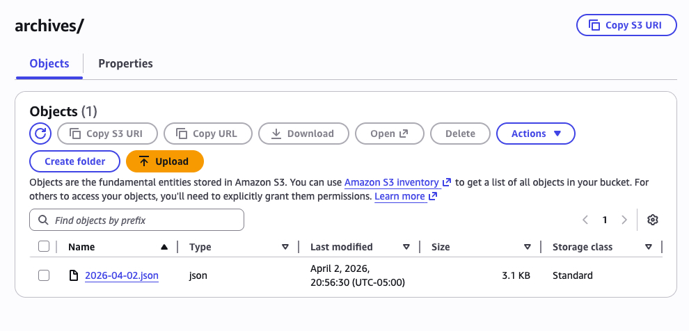
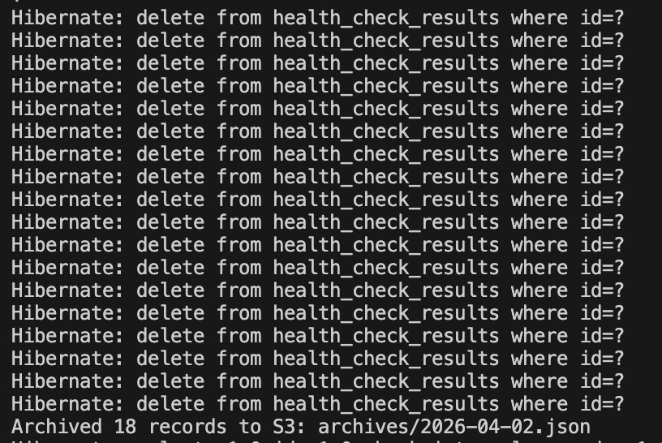

# UptraceIQ

A system health and uptime monitoring platform that tracks endpoint availability, response times, and incidents in real time.

## Why I Built This

I just graduated with my Software Engineering degree and wanted to build something that goes beyond a typical CRUD app. Uptime monitoring is a real problem that every engineering team deals with — services go down, APIs slow to a crawl, and someone needs to know about it before the users do. I wanted to build that system from scratch.

This project pushes me to work across the full stack with technologies I'll actually use on the job:

- **Java concurrency** — using `CompletableFuture` for parallel HTTP requests instead of checking endpoints one at a time. Understanding async patterns and thread management is something I didn't get deep enough into during school.
- **Spring Boot** — the most widely used Java backend framework in the industry. Learning dependency injection, JPA, scheduling, and REST API design through a real use case rather than tutorial examples.
- **AWS services** — hands-on experience with RDS, S3, Lambda, SNS, and CloudWatch. Not just clicking through the console, but understanding why you'd pick one service over another and how they fit together.
- **System design thinking** — making decisions like "where does this data live?", "what happens when an endpoint is unreachable?", and "how do we keep the database lean while archiving old data?" These are the kinds of tradeoffs that don't come up in coursework.

Each phase is built incrementally so I can understand every layer before adding the next one.

## Tech Stack

| Layer | Technology |
|-------|-----------|
| **Frontend** | React 18, Tailwind CSS |
| **Backend** | Java 17, Spring Boot 3 |
| **Database** | AWS RDS PostgreSQL |
| **Storage** | AWS S3 (metrics archiving) |
| **Alerts** | AWS Lambda + SNS |
| **Monitoring** | AWS CloudWatch |

## Project Roadmap

| Phase | Focus | Description | Status |
|-------|-------|-------------|--------|
| 1 | Project Setup | Spring Boot 3, Maven, H2 dev database, Actuator health endpoint | ✅ |
| 2 | Health Check Model & Engine | JPA entities, repositories, `CompletableFuture` parallel health checks | ✅ |
| 3 | RDS Metrics & Persistence | Connect to AWS RDS PostgreSQL, migrate off H2 for production data | ✅ |
| 4 | S3 Metrics Archiving | Archive older metrics to S3, keep RDS lean | ✅ |
| 5 | Lambda Alerts & SNS | AWS Lambda processes metric batches, SNS sends notifications on incidents | |
| 6 | REST API | Spring Boot endpoints for the React dashboard to consume | |
| 7 | React Dashboard | Uptime charts, response time graphs, incident feed, live status badges | |
| 8 | Alert Thresholds | Configurable response time and failure thresholds per endpoint | |

## Architecture

The Java backend pings configurable endpoints on a schedule using `CompletableFuture` for parallel HTTP requests. Results (response time, status code, availability) are stored in RDS PostgreSQL. AWS Lambda processes metric batches and triggers alerts via SNS when services go down or response times spike.

The React dashboard displays uptime percentages, response time charts, incident history, and live status indicators.

## Project Phases

### Phase 1 — Project Setup
Initialized the Spring Boot 3 project with Maven. Configured dependencies: Spring Web (REST API), Spring Data JPA (database abstraction), PostgreSQL Driver (for future AWS RDS connection), and Spring Boot Actuator (application health monitoring). Added H2 as an in-memory development database so the app runs locally without a real PostgreSQL instance.


*H2 in-memory database console — used for local development before connecting to AWS RDS PostgreSQL.*


*Spring Boot Actuator health endpoint — returns service status. AWS load balancers will use this to verify our backend is alive.*

---

### Phase 2 — Health Check Domain Model & Service Engine
Built the core data model and monitoring engine:
- **Endpoint entity** — JPA entity representing a monitored service (URL, name, check interval, enabled toggle). Maps to the `endpoints` database table.
- **HealthCheckResult entity** — JPA entity storing individual ping results (status code, response time, health status, error messages). Linked to Endpoint via a Many-to-One foreign key relationship.
- **HealthStatus enum** — `UP`, `DOWN`, or `DEGRADED` — restricts health outcomes to valid states only.
- **Repository interfaces** — Spring auto-generates database CRUD operations from interface method names (query derivation). No manual SQL written.
- **HealthCheckService** — the core engine. Uses `CompletableFuture` (Java's `Promise.all()` equivalent) to ping all enabled endpoints in parallel every 30 seconds. Records response time, status code, and health status to the database. Catches connection failures and timeouts gracefully.


*JPA entities auto-generated the `endpoints` and `health_check_results` tables in H2 — no SQL written manually.*


*Health checks running live — Google (301 redirect), GitHub (200 UP), and a fake endpoint (DOWN). All three checked in parallel via CompletableFuture.*

---

### Phase 3 — RDS Metrics & Persistence
Connected the backend to AWS RDS PostgreSQL for persistent data storage. Set up Spring profiles to support dual environments — H2 for local development and RDS for production. Database credentials are stored securely using environment variables (`${RDS_PASSWORD}`) instead of hardcoded values. Health check results now survive application restarts, proving the monitoring data is durable.


*AWS RDS PostgreSQL instance running in us-east-1 — the production database for all health check data.*


*Health check results being written to RDS PostgreSQL in real time — three endpoints checked in parallel every 30 seconds.*


*Health check results persisted in RDS PostgreSQL — data survives app restarts, unlike the H2 in-memory database.*

---

### Phase 4 — S3 Metrics Archiving
Built an automated archiving system that moves health check data older than 7 days from RDS to S3. The archiver runs on a daily schedule — queries old records, serializes them to JSON, uploads to S3 with a date-stamped filename, then deletes the originals from RDS. This keeps the database lean while preserving all historical data in cheap cloud storage. AWS credentials are handled through environment variables, same pattern as the RDS password.


*S3 bucket created in us-east-1 — stores archived health check metrics as JSON files.*


*Archived JSON file stored in S3 — 18 health check records exported as `archives/2026-04-02.json`.*


*Archiver queried old records from RDS, uploaded to S3, then deleted them from the database to keep it lean.*


## Running Locally

### Prerequisites
- Java 17+
- Maven 3.9+

### Backend (Local - H2)
```bash
cd backend
./mvnw spring-boot:run
```

### Backend (RDS — AWS PostgreSQL)
```bash
cd backend
export RDS_PASSWORD=your_rds_password
./mvnw spring-boot:run -Dspring-boot.run.profiles=rds
```

