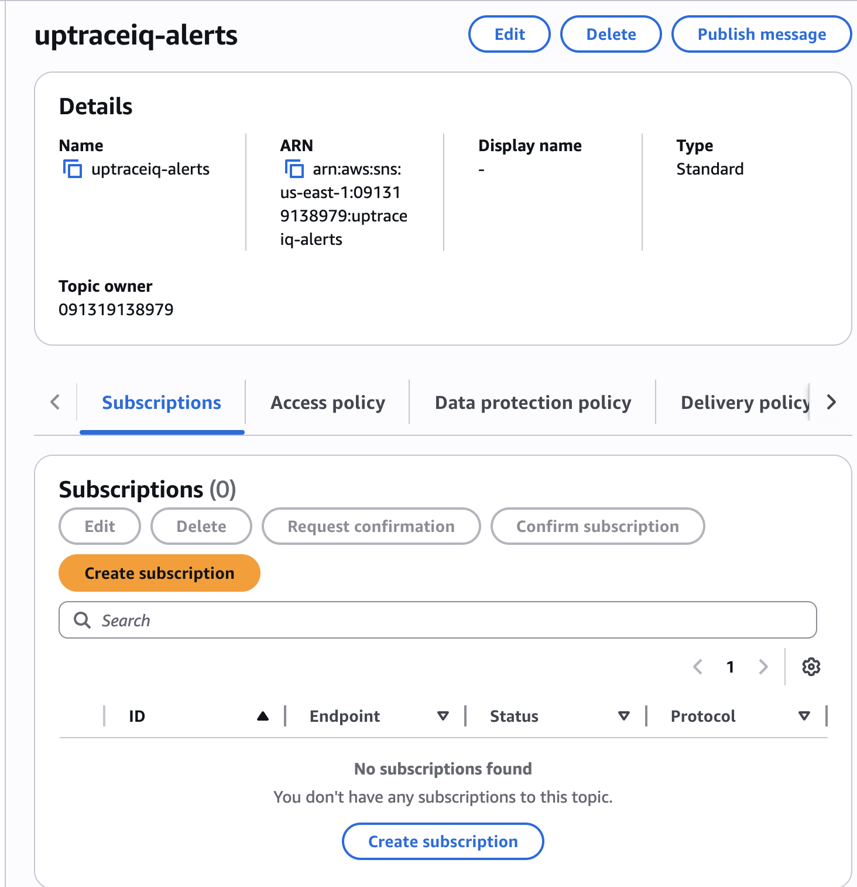
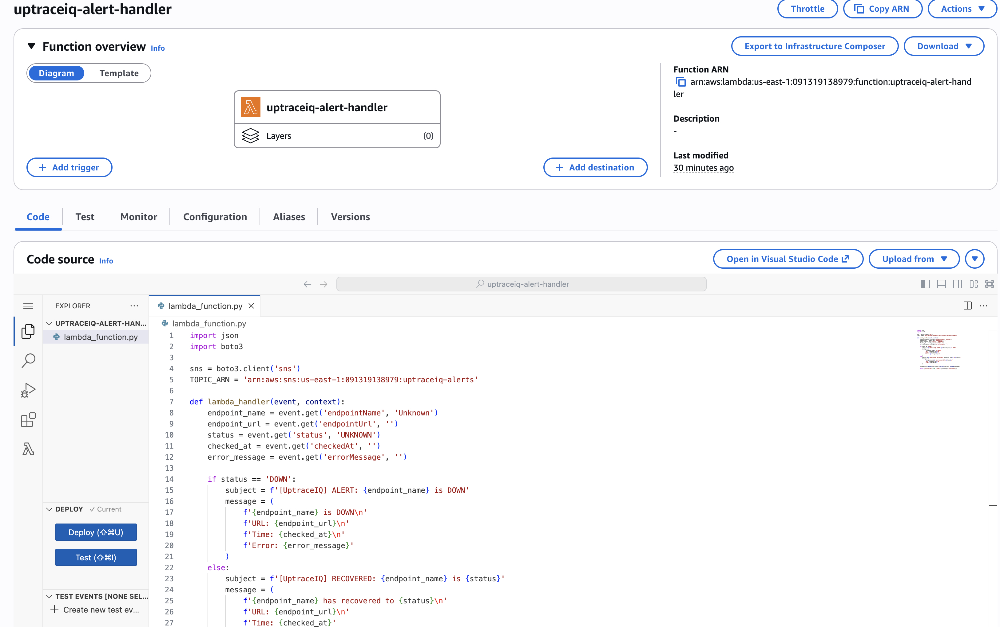
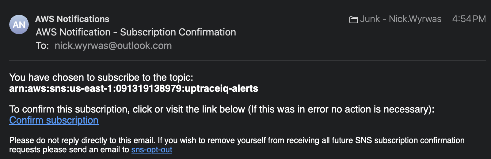
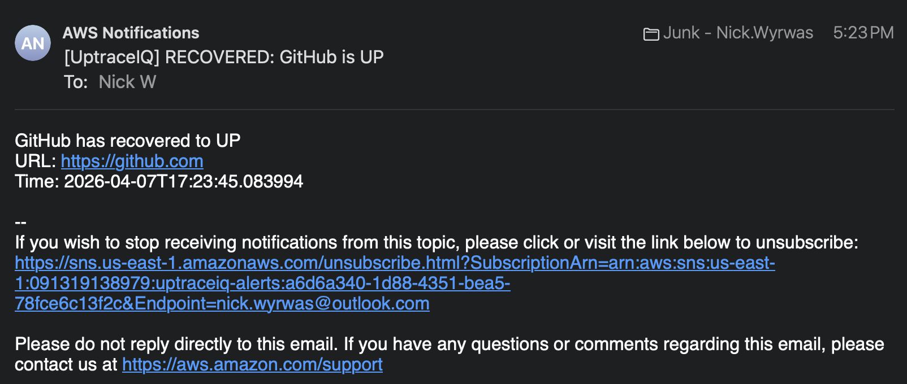

# UptraceIQ

A system health and uptime monitoring platform that tracks endpoint availability, response times, and incidents in real time — with automated alerting when services go down.

## Context

### The Problem
Every engineering team needs to know when their services go down — ideally before users start complaining. Uptime monitoring is a solved problem at companies with dedicated SRE teams and expensive tools like Datadog or PagerDuty. But building one from scratch forces you to make every decision yourself: where does the data live, how do you check endpoints without blocking, what happens when the database fills up, and how do you alert the right people at the right time.

### Why I Built This
I just graduated with my Software Engineering degree and wanted to build something that goes beyond a typical CRUD app. This project pushes me to work across the full stack with technologies I'll actually use on the job:

- **Java concurrency** — using `CompletableFuture` for parallel HTTP requests instead of checking endpoints one at a time
- **Spring Boot 3** — dependency injection, JPA, scheduling, and REST API design through a real use case
- **AWS services** — hands-on experience with RDS, S3, Lambda, and SNS, understanding how they fit together
- **System design thinking** — decisions like "where does this data live?", "how do we keep the database lean?", and "when should we alert vs stay quiet?"

Each phase is built incrementally so I can understand every layer before adding the next one.

## Tech Stack

| Layer | Technology |
|-------|-----------|
| **Frontend** | React 18, Tailwind CSS |
| **Backend** | Java 17, Spring Boot 3 |
| **Database** | AWS RDS PostgreSQL |
| **Storage** | AWS S3 (metrics archiving) |
| **Alerts** | AWS Lambda + SNS |
| **Monitoring** | AWS CloudWatch |

## Project Roadmap

| Phase | Focus | Description | Status |
|-------|-------|-------------|:------:|
| 1 | Project Setup | Spring Boot 3, Maven, H2 dev database, Actuator health endpoint | ✅ |
| 2 | Health Check Model & Engine | JPA entities, repositories, `CompletableFuture` parallel health checks | ✅ |
| 3 | RDS Metrics & Persistence | Connect to AWS RDS PostgreSQL, migrate off H2 for production data | ✅ |
| 4 | S3 Metrics Archiving | Archive older metrics to S3, keep RDS lean | ✅ |
| 5 | Lambda Alerts & SNS | AWS Lambda formats alerts, SNS sends email notifications on incidents | ✅ |
| 6 | REST API | Spring Boot endpoints for the React dashboard to consume | |
| 7 | React Dashboard | Uptime charts, response time graphs, incident feed, live status badges | |
| 8 | Alert Thresholds | Configurable response time and failure thresholds per endpoint | |

## Architecture

```
                         UptraceIQ — System Architecture

  +------------------+     every 30s      +-------------------+
  |   Endpoints      | <----- ping -----> | HealthCheckService |
  |  (Google, GitHub, |                   |  (CompletableFuture|
  |   custom URLs)   |                    |   parallel checks) |
  +------------------+                    +--------+----------+
                                                   |
                                          save result to DB
                                                   |
                                          +--------v----------+
                                          |   AlertService     |
                                          | (status transition |
                                          |    detection)      |
                                          +--------+----------+
                                                   |
                                     status changed? (UP->DOWN)
                                                   |
                                          +--------v----------+
                                          |   AWS Lambda       |
                                          | (format alert msg) |
                                          +--------+----------+
                                                   |
                                          +--------v----------+
                                          |    AWS SNS         |
                                          | (deliver email)    |
                                          +-------------------+

  +-------------------+    every 24h     +--------------------+
  |    AWS RDS        | <--- archive --> | MetricsArchiveService|
  |   PostgreSQL      |                  | (query old records,  |
  | (recent 7 days)   |                 |  upload JSON to S3,  |
  +-------------------+                  |  delete from RDS)    |
                                         +--------------------+
                                                  |
                                         +--------v----------+
                                         |     AWS S3         |
                                         | (archives/         |
                                         |  2026-04-02.json)  |
                                         +-------------------+
```

## Project Phases

### Phase 1 — Project Setup

Initialized the Spring Boot 3 project with Maven. Configured core dependencies: Spring Web, Spring Data JPA, PostgreSQL Driver, and Spring Boot Actuator. Added H2 as an in-memory development database so the app runs locally without any external services.

**Key implementation details:**
- Spring Boot auto-configures an embedded Tomcat server, database connection pool, and JPA/Hibernate from the dependencies alone
- Actuator exposes `/actuator/health` — used by load balancers to verify the backend is alive
- H2 runs inside the JVM with zero setup — the database exists only in memory and resets every restart
- Maven wrapper (`./mvnw`) ensures consistent builds without requiring a global Maven install


*H2 in-memory database console — used for local development before connecting to AWS RDS PostgreSQL.*


*Spring Boot Actuator health endpoint — returns service status for load balancer health checks.*

---

### Phase 2 — Health Check Domain Model & Service Engine

Built the core data model and monitoring engine that pings endpoints in parallel every 30 seconds using `CompletableFuture`.

**Key implementation details:**
- **Endpoint entity** — JPA entity representing a monitored service (URL, name, check interval, enabled toggle). Maps to the `endpoints` database table via `@Entity` and `@Table` annotations.
- **HealthCheckResult entity** — stores individual ping results (status code, response time, health status, error messages). Linked to Endpoint via `@ManyToOne` with `FetchType.LAZY` to avoid unnecessary data loading.
- **HealthStatus enum** — `UP`, `DOWN`, or `DEGRADED` — stored as strings in the database via `@Enumerated(EnumType.STRING)`.
- **Repository interfaces** — Spring auto-generates SQL from method names (query derivation). `findByEnabledTrue()` becomes `SELECT * FROM endpoints WHERE enabled = true`.
- **HealthCheckService** — uses `CompletableFuture.runAsync()` for parallel execution, `CompletableFuture.allOf().join()` to wait for completion. Java's equivalent of `Promise.all()`.

> **Challenge:** Checking 3 endpoints sequentially took 6+ seconds (2s each). With 100 endpoints, this would take over 3 minutes per check cycle.

> **Solution:** `CompletableFuture.runAsync()` runs each check on its own thread. All endpoints are checked simultaneously — total time equals the slowest single check, not the sum.

> **Challenge:** Needed a way to represent the relationship between endpoints and their check results without writing raw SQL joins.

> **Solution:** JPA's `@ManyToOne` annotation with `@JoinColumn` creates the foreign key automatically. Spring Data's query derivation generates SQL from method names — no manual queries needed.


*JPA entities auto-generated the `endpoints` and `health_check_results` tables in H2 — no SQL written manually.*


*Health checks running live — Google (301 redirect), GitHub (200 UP), and a fake endpoint (DOWN). All three checked in parallel via CompletableFuture.*

---

### Phase 3 — RDS Metrics & Persistence

Connected the backend to AWS RDS PostgreSQL for persistent data storage. Set up Spring profiles to support dual environments — H2 for local development and RDS for production — without changing any Java code.

**Key implementation details:**
- **Spring profiles** swap database configuration at runtime. `application-dev.properties` configures H2, `application-rds.properties` configures PostgreSQL. The `-Dspring-boot.run.profiles=rds` flag overrides the default.
- **Environment variables** (`${RDS_PASSWORD}`) keep credentials out of the codebase. Spring resolves `${}` placeholders from OS environment variables at startup.
- **Hibernate `ddl-auto=update`** compares `@Entity` classes to existing tables and adds missing columns/tables — never deletes. Safe for production schema evolution.
- **Security groups** act as a network firewall in front of RDS. Without the inbound rule on port 5432, connections are rejected before the password is even checked.

> **Challenge:** `data.sql` seed data ran automatically on H2 but was silently ignored on RDS, leaving the endpoints table empty. Health checks ran but found nothing to check.

> **Solution:** Spring Boot only auto-runs `data.sql` for embedded databases. PostgreSQL is external, so Spring skips it by design — prevents re-inserting data on every production restart. Seeded RDS manually via `psql`.

> **Challenge:** Needed to keep H2 for fast local development while also supporting RDS for production data — without maintaining two separate codebases or configurations.

> **Solution:** Spring profiles load different properties files based on the active profile. The same Java code connects to H2 or PostgreSQL depending on a single runtime flag. No `if` statements, no environment checks in code.


*AWS RDS PostgreSQL instance running in us-east-1 — the production database for all health check data.*


*Health check results being written to RDS PostgreSQL in real time — three endpoints checked in parallel every 30 seconds.*


*Health check results persisted in RDS — data survives app restarts, unlike the H2 in-memory database.*

---

### Phase 4 — S3 Metrics Archiving

Built an automated archiving system that moves health check data older than 7 days from RDS to AWS S3. Keeps the database lean while preserving all historical data in cheap cloud storage.

**Key implementation details:**
- **MetricsArchiveService** runs on a `@Scheduled(fixedRate = 86400000)` cycle (24 hours). Queries old records, serializes to JSON via Jackson `ObjectMapper`, uploads to S3, then deletes from RDS.
- **S3Config.java** uses `@Configuration` + `@Bean` to create an `S3Client` that Spring injects via constructor. The AWS SDK reads credentials from environment variables automatically (default credential provider chain).
- **Upload-first, delete-second** pattern ensures no data loss. If the S3 upload fails, the `catch` block runs and `deleteAll()` is never reached — records stay safe in RDS.
- **Date-stamped keys** (`archives/2026-04-02.json`) give each archive a unique path. S3 is a flat key-value store — slashes in keys render as folders in the console.

> **Challenge:** Health checks write 8,640 rows/day to RDS (3 endpoints x 30s intervals). After a few months, queries slow down and storage costs climb on PostgreSQL ($0.115/GB/month).

> **Solution:** Archive anything older than 7 days to S3 ($0.023/GB/month, first 5GB free). Daily archives are ~3KB each — a full year costs fractions of a penny. RDS stays fast with only recent data.

> **Challenge:** Serializing JPA entities directly with Jackson caused cascading relationship loading — `@ManyToOne` pulled in the full Endpoint object for every result.

> **Solution:** Manually mapped each `HealthCheckResult` to a `HashMap<String, Object>` with only the fields needed. Full control over the JSON output, no accidental relationship traversal.


*S3 bucket created in us-east-1 — stores archived health check metrics as JSON files.*


*Archived JSON file stored in S3 — 18 health check records exported as `archives/2026-04-02.json`.*


*Archiver queried old records from RDS, uploaded to S3, then deleted them from the database to keep it lean.*

---

### Phase 5 — Lambda Alerts & SNS

Added real-time email alerting when endpoints go down or recover. Spring Boot detects status transitions, invokes an AWS Lambda function to format the alert, and Lambda publishes to SNS which delivers the email.

**Key implementation details:**
- **AlertService** compares the current health check status against the most recent previous result. Only fires on actual transitions (UP→DOWN or DOWN→UP) — prevents inbox spam from repeated DOWN checks.
- **AWS Lambda** (Python 3.12) receives incident data as JSON, formats a human-readable email with endpoint name, URL, timestamp, and error details, then publishes to SNS.
- **LambdaConfig.java** follows the same `@Configuration` + `@Bean` pattern as S3Config — creates a `LambdaClient` bean that Spring injects into AlertService.
- **SNS topic** (`uptraceiq-alerts`) fans out notifications to all subscribers. Currently delivers email, but the same topic could trigger SMS, Slack webhooks, or other Lambda functions.
- **IAM role** grants the Lambda function `sns:Publish` permission — without it, Lambda can execute but can't send notifications.

> **Challenge:** Health checks run every 30 seconds. A DOWN endpoint generates a new DOWN result every cycle — naive alerting would send an email every 30 seconds for the same outage.

> **Solution:** AlertService queries the previous result with `findTopByEndpointIdOrderByCheckedAtDesc()` and compares statuses. Only transitions trigger alerts. An endpoint that's been DOWN for an hour sends exactly one alert — when it first went down — and one recovery email when it comes back.

> **Challenge:** The alert check runs after `resultRepository.save()`, so querying the "previous" result returned the one we just saved — making previous status always equal current status, and alerts never fired.

> **Solution:** Moved `alertService.checkAndAlert()` to run BEFORE `resultRepository.save()`. Now the "most recent" query returns the actual previous result, and status transitions are detected correctly.

> **Challenge:** Lambda's default execution role only includes CloudWatch Logs permissions. The function ran successfully but `sns.publish()` threw an access denied error.

> **Solution:** Attached the `AmazonSNSFullAccess` policy to Lambda's execution role via IAM. In production, you'd scope this down to only `sns:Publish` on the specific topic ARN.


*SNS topic created in us-east-1 — the message channel that delivers alerts to all subscribers.*


*AWS Lambda function (Python 3.12) — receives incident data from Spring Boot, formats the alert, and publishes to SNS.*


*SNS email subscription confirmed — alerts will be delivered to this address when endpoints go down or recover.*


*DOWN alert email — triggered when GitHub's endpoint was changed to an unreachable URL. Shows endpoint name, URL, timestamp, and error details.*


*Recovery email — triggered when GitHub's endpoint was restored to the correct URL. Confirms the service is back UP.*

---

## Running Locally

### Prerequisites
- Java 17+
- Maven 3.9+

### Backend (Local — H2)
```bash
cd backend
./mvnw spring-boot:run
```

### Backend (RDS — AWS PostgreSQL)
```bash
cd backend
export RDS_PASSWORD=your_rds_password
./mvnw spring-boot:run -Dspring-boot.run.profiles=rds
```
